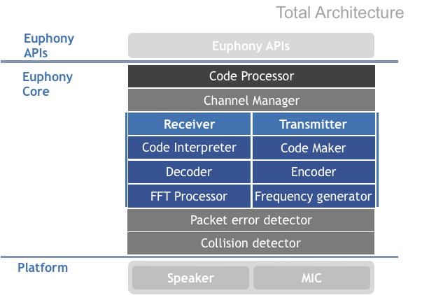

========
 [](https://coveralls.io/github/designe/euphony?branch=master) [](https://opensource.org/licenses/Apache-2.0) [  ](https://bintray.com/jbear/maven/euphony/0.7.1.6/link)

Acoustic Data Telecommunication Library. This is for Android version.  
Euphony provides a handiness library designed to communicate with other devices(android and web) using mic and recorder.  

Official Facebook Page : [https://www.facebook.com/euphonyproject] (https://www.facebook.com/euphonyproject)

## Prerequisite
1) build.gradle in app module
```
dependencies {
    implementation 'euphony.lib:euphony:0.7.1.6'
}
```

2) AndroidManifest.xml
```
<uses-permission android:name="android.permission.RECORD_AUDIO" />
```

## Euphony is very easy to use

in Transmitter
```java
EuTxManager mTxManager = new EuTxManager();
mTxManager.euInitTransmit("Hello, Euphony"); // To generate acoustic data "Hello, Euphony"
mTxManager.process(-1); // generate sound infinite.
```

in Receiver
```java
EuRxManager mRxManager = new EuRxManager();
mRxManager.listen();  //Listening Start
// if you want to finish listening, call the finish();
// mRxManager.finish();
mRxManager.setAcousticSensor(new AcousticSensor() {
@Override
    public void notify(String letters) {
        //when data is received
    }
});
```

## Architecture


## Web version
Web version is also available now. but only transmitter version. [Web version.] (https://github.com/designe/euphony.js)

## Contributing
Changes are improvements are more than welcome! Feel Free to fork and open a pull request. Please make your changes in a specific branch and request to pull into `master`.

## License
Euphony is licensed under the Apache 2.0 license. (https://github.com/designe/Euphony/blob/master/LICENSE)
